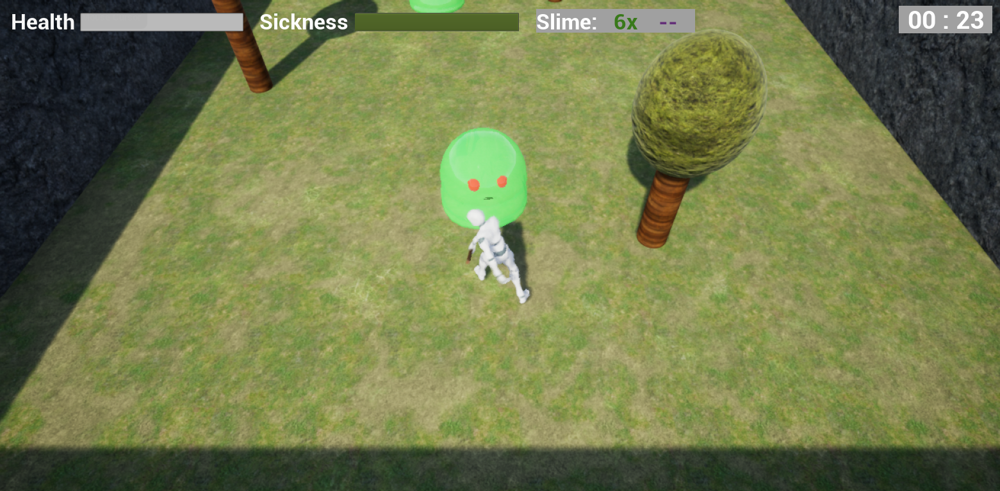
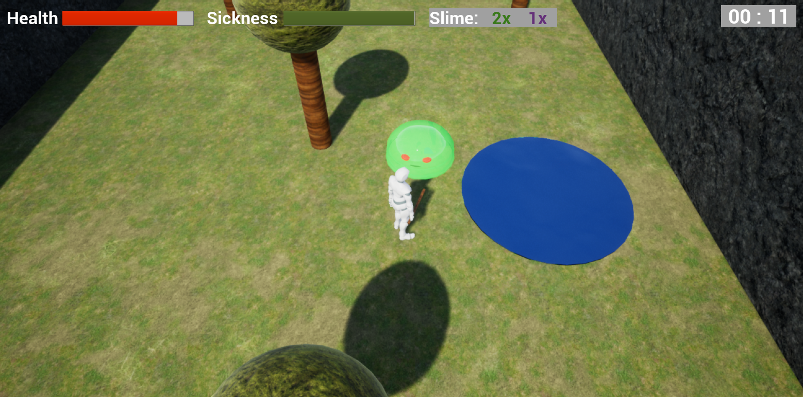
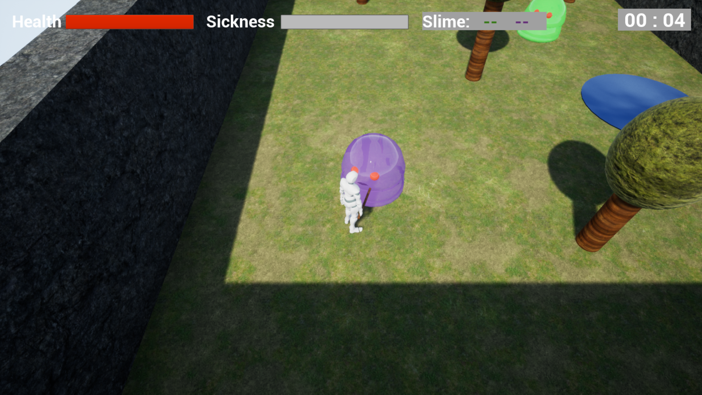
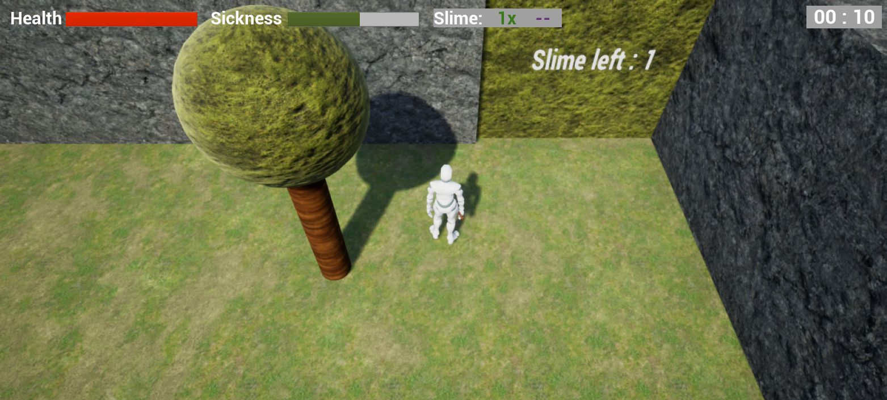
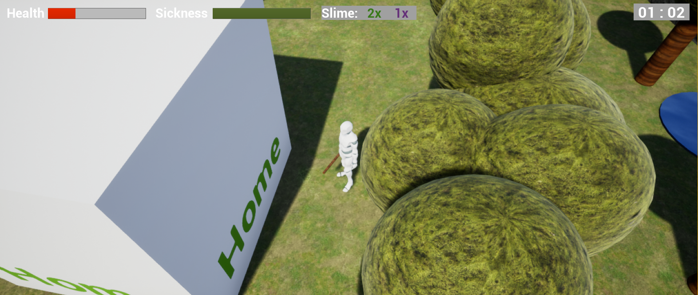

# Forest of the Slimes

This is an assignment made for the course Game Mechanics in DAE. 
We used Unreal Engine, mostly blueprints (because a lack of time to go deeper into c++).

We each got assigned 2 words to use as starting point for our mechanic. My words were Aversion & Frail.

With this I created an adventure type of game. You are lost in the forest and want to go home but... this is The Forest of the Slimes. 
They will attack intruders in their forest and are easy to blow apart, but if you do, their smelly dirty slime spats everywhere. BAH, careful not to get sick from this terrible smell. Better find some water quickly to wash it off. In your hurry to find water, you will walk slightly faster, but lose health from sickness. You will also find different types of slimes on your way, through the higher levels.

